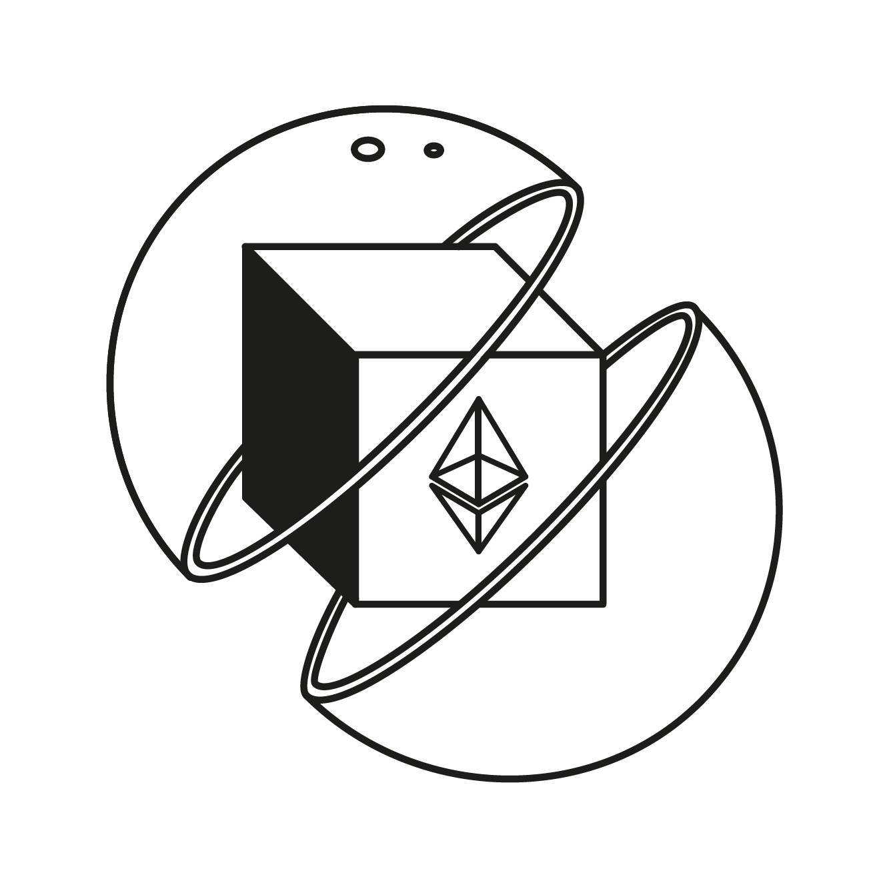

# stataToken - Static aToken vault/wrapper

<p align="center">

</p>

## About

This repository contains an [EIP-4626](https://eips.ethereum.org/EIPS/eip-4626) generic token vault/wrapper for all [Aave v3](https://github.com/aave/aave-v3-core) pools.

## Features

- **Full [EIP-4626](https://eips.ethereum.org/EIPS/eip-4626) compatibility.**
- **Accounting for any potential liquidity mining rewards.** Let’s say some team of the Aave ecosystem (or the Aave community itself) decides to incentivize deposits of USDC on Aave v3 Ethereum. By holding `stataUSDC`, the user will still be eligible for those incentives.
  It is important to highlight that currently the wrapper only supports 1 reward token by design (e.g. AAVE incentivizing aUSDC), but this is something that can be added in the future without breaking changes[⁽¹⁾](#limitations).
- **Meta-transactions support.** To enable interfaces to offer gas-less transactions to deposit/withdraw on the wrapper/Aave protocol (also supported on Aave v3). Including permit() for transfers of the `stataAToken` itself.
- **Upgradable by the Aave governance.** Similar to other contracts of the Aave ecosystem, the Level 1 executor (short executor) will be able to add new features to the deployed instances of the `stataTokens`.
- **Powered by a stataToken Factory.** Whenever a token will be listed on Aave v3, anybody will be able to call the stataToken Factory to deploy an instance for the new asset, permissionless, but still assuring the code used and permissions are properly configured without any extra headache.

See [IStaticATokenLM.sol](./src/interfaces/IStaticATokenLM.sol) for detailed method documentation.

## Limitations

The static aToken will keep track of LM rewards per user only for the first token listed on the incentives controller present on token initialization.

The static aToken is using transparent proxy pattern, so the token is potentially upgradable to keep track of a new incentives controller or token down the line.

## Security procedures

For this project, the security procedures applied/being finished are:

- The test suite of the codebase itself.
- Certora audit/property checking for all the dynamics of the `stataToken`, including respecting all the specs of [EIP-4626](https://eips.ethereum.org/EIPS/eip-4626).

## Development

This project uses [Foundry](https://getfoundry.sh). See the [book](https://book.getfoundry.sh/getting-started/installation.html) for detailed instructions on how to install and use Foundry.
The template ships with sensible default so you can use default `foundry` commands without resorting to `MakeFile`.

### Setup

```sh
cp .env.example .env
forge install
```

### Test

```sh
forge test
```
